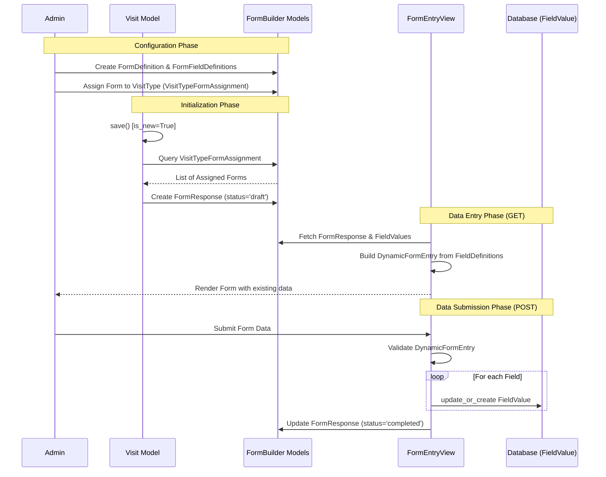

# Ecareda Form Backend Workflow

This document explains the technical flow of form handling in the `ecareda` backend, from initial configuration to data storage.

## Workflow Overview

The form system is built to be dynamic, allowing administrators to define forms and fields in the database. These forms are then automatically instantiated when visits are created for subjects.

### 1. Visual Flow (Sequence Diagram)

### 2. Key Components

| Component | Responsibility |
| :--- | :--- |
| **[FormDefinition](file:///home/maquiz/Documents/FINAL_PROJECTS/ecareda/backend/forms_builder/models/form_definition_model.py#5-18)** | The template for a form (e.g., "Baseline Vital Signs"). |
| **[FormFieldDefinition](file:///home/maquiz/Documents/FINAL_PROJECTS/ecareda/backend/forms_builder/models/form_field_definition_model.py#6-32)** | Defines individual fields (label, type, required, order). |
| **[Visit](file:///home/maquiz/Documents/FINAL_PROJECTS/ecareda/backend/visits/models/visits_model.py#10-130)** | The trigger for form instantiation. It auto-creates [FormResponse](file:///home/maquiz/Documents/FINAL_PROJECTS/ecareda/backend/forms_builder/models/form_response_model.py#10-83) records on its first [save()](file:///home/maquiz/Documents/FINAL_PROJECTS/ecareda/backend/forms_builder/models/form_response_model.py#72-80). |
| **[VisitTypeFormAssignment](file:///home/maquiz/Documents/FINAL_PROJECTS/ecareda/backend/forms_builder/models/visit_type_form_assignment_model.py#7-35)** | Links forms to specific visit types (e.g., "Screening") within a project. |
| **[FormResponse](file:///home/maquiz/Documents/FINAL_PROJECTS/ecareda/backend/forms_builder/models/form_response_model.py#10-83)** | A specific instance of a form filled out for a subject's visit. Tracks status (draft, completed, locked). |
| **[DynamicFormEntry](file:///home/maquiz/Documents/FINAL_PROJECTS/ecareda/backend/forms_builder/forms/form_entry_form.py#5-141)** | A Django [Form](file:///home/maquiz/Documents/FINAL_PROJECTS/ecareda/backend/forms_builder/views/form_list_view.py#10-14) class that generates fields dynamically at runtime. |
| **[FieldValue](file:///home/maquiz/Documents/FINAL_PROJECTS/ecareda/backend/forms_builder/models/field_value_model.py#6-22)** | Stores the actual user input linked to a specific [FormResponse](file:///home/maquiz/Documents/FINAL_PROJECTS/ecareda/backend/forms_builder/models/form_response_model.py#10-83) and [FormFieldDefinition](file:///home/maquiz/Documents/FINAL_PROJECTS/ecareda/backend/forms_builder/models/form_field_definition_model.py#6-32). |

### 3. Data Integrity & Locking

- **Visit Locking**: If a [Visit](file:///home/maquiz/Documents/FINAL_PROJECTS/ecareda/backend/visits/models/visits_model.py#10-130) status is set to "locked", its [save()](file:///home/maquiz/Documents/FINAL_PROJECTS/ecareda/backend/forms_builder/models/form_response_model.py#72-80) method prevents further modifications.
- **Form Locking**: If a [FormResponse](file:///home/maquiz/Documents/FINAL_PROJECTS/ecareda/backend/forms_builder/models/form_response_model.py#10-83) status is "locked", the [FormEntryView](file:///home/maquiz/Documents/FINAL_PROJECTS/ecareda/backend/forms_builder/views/form_entry_view.py#8-67) will redirect the user away, and the `FormResponse.save()` method will raise a `ValueError` if any changes are attempted.
